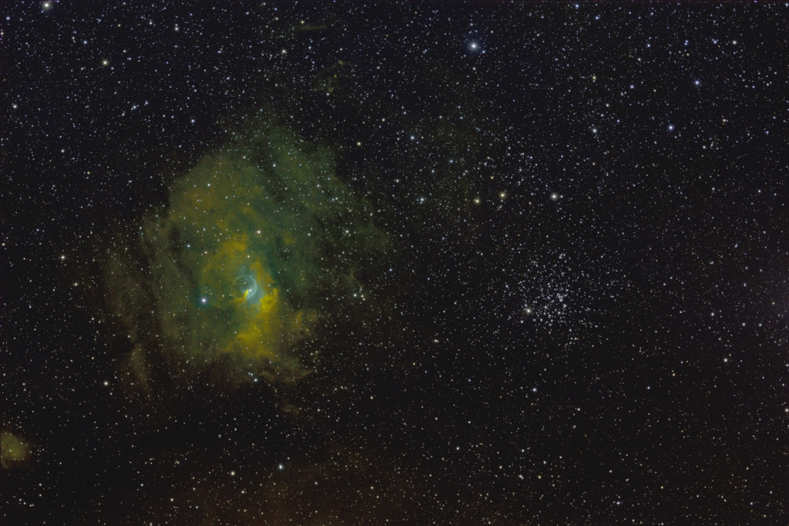

# The Bubble Nebula (NGC 7635) and Open Cluster M52: Unprocessed Narrowband Subexposures

Some sample data for processing with [Nightlight](https://github.com/mlnoga/nightlight).

## Subexposures

| Channel | Subexposures | Duration per subexposure| Total duration |
|---------|--------------|-------------------------|----------------|
|Ha       |           19 |                 600s    |     3 h 10 min |
|O3       |           19 |                 400s    |     2 h  6 min |
|S2       |           19 |                 500s    |     2 h 38 min |
|Total    |           66 |                 -       |     7 h 54 min |

* Image size is 5496 x 3672, or 20 Megapixels
* Storage size is 16 bits per pixel, or 40 MB
* Image scale is 1.07 arcseconds/pixel

## Equipment

| Item     | Description |
|----------|-------------|
| Camera   | ASI 183 mm pro, which has a 12 bit DAC, at -20 Celsius, gain 50 offset 8 |
| Telescope| Takahashi FC 76 DCU with a 0.8x Televue reducer, at an effective focal length of 456 mm with 76 mm aperture (f/6.0) |
| Filters  | Baader LRGB filters in an ASI 7x36mm electronic filter wheel |
| Guider   | ASI 290mm mini guider in ASI OAG |
| Mount    | Vixen GP-D2 with TeenAstro controller on a wooden Berlebach Uni tripod | 
| Time     | May 2020 |
| Location | Southern Germany |

## License

This dataset is Copyright (C) 2020 by Markus Noga. All rights reserved.

It is licensed under [CC BY-NC-SA 4.0CC](https://creativecommons.org/licenses/by-nc-sa/4.0).
